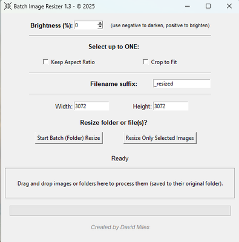
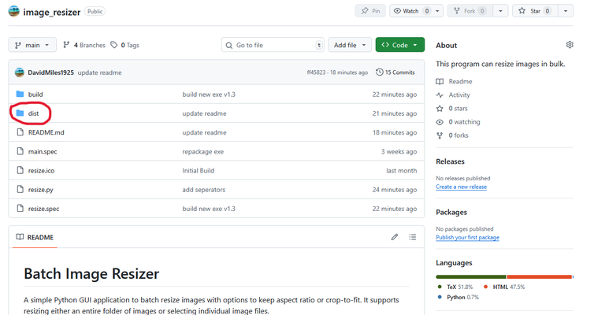
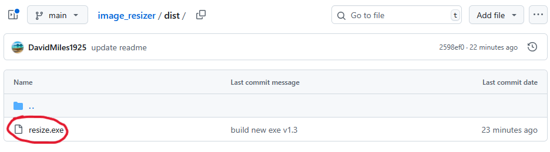
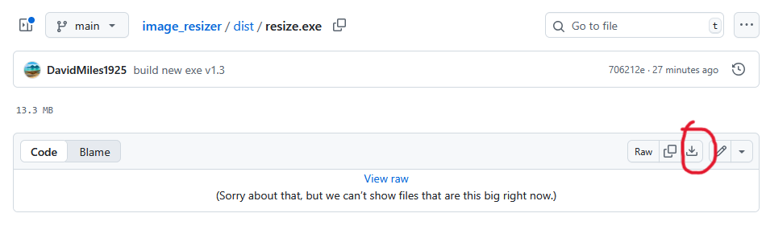
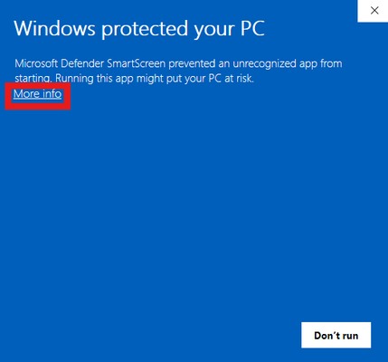
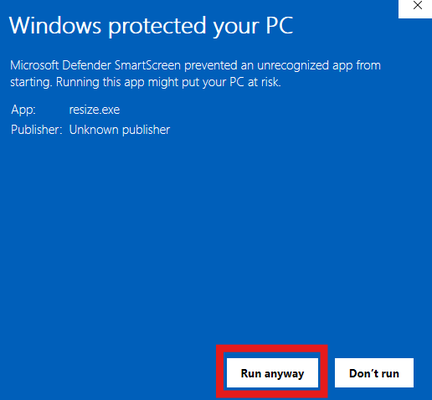

# Batch Image Resizer v1.4

A simple Python GUI application to batch resize images with options to keep aspect ratio or crop-to-fit. It supports resizing either an entire folder of images or selecting individual image files.

---

## Features

- Resize images to any specified width and height. (updated v1.3)
- Option to **increase brightness** by a specified amount (updated v1.3)
- Option to **keep aspect ratio** (resize to fit within target size without distortion).
- Option to **crop-to-fit** (resize and crop images to exactly fill the target size).
- Option to **edit file suffix**. (added v1.2)
- Resize all images in a folder or select specific image files.
- Drag and drop files to the GUI to resize them. (added v1.3)
- Progress bar to track batch resizing progress.
- Display current working filename above the progress bar. (v1.2)
- Supports common image formats: JPG, JPEG, PNG, BMP, GIF. HEIC/HEIF added in v1.4
- User-friendly dialogs guide you through each step.



---

## Windows Installation

**1. From the `/dist` folder above, download and run the file `resize.exe`.**



Then...



Then...



**2. When the warning appears, click "More Info" followed by "Run Anyway"**



Then...



---

## Python Installation

### Requirements

- Python 3.7 or later
- See requirements.txt for Python package dependencies (recommended)
  - Pillow (image handling)
  - tkinterdnd2 (optional: drag & drop support)
- Standard Python libraries: `tkinter` (usually included with Python)

### Procedure

1. Clone this repository or download the script file.

```bash
git clone https://github.com/DavidMiles1925/image_resizer.git
```

2. Install dependencies from requirements.txt:

```bash
pip install -r requirements.txt
```

Notes:

- The `tkinterdnd2` package is optional. If it's not installed the app still runs, but drag & drop support will not be available.
- On Debian/Ubuntu you may also need to install the system tkinter package:
  - sudo apt-get install python3-tk

3. Run the program:

```bash
python resize.py
```

---

## Troubleshooting

### Installation and startup

- Tkinter not found (ModuleNotFoundError: \_tkinter or TclError at startup)
  - Linux (Debian/Ubuntu): sudo apt-get install python3-tk
  - Fedora: sudo dnf install python3-tkinter
  - Arch: sudo pacman -S tk
  - macOS: Prefer the official Python installer from python.org (ships with a compatible Tk). Homebrew Python may need: brew install python-tk@3.XX or use the python.org build.
- Drag & Drop not available message on startup
  - Install optional package and restart: pip install tkinterdnd2
  - If still unavailable, your Tk build/OS windowing system may not support tkdnd (see Drag & Drop section below).
- Pillow version errors (e.g., AttributeError: module 'PIL.Image' has no attribute 'Resampling')
  - Upgrade Pillow to a version that supports Image.Resampling (>= 9.1): pip install --upgrade "pillow>=9.1"
- Running from source vs. installing dependencies
  - Use: pip install -r requirements.txt
  - If using a virtual environment, ensure it is activated before running the command.

### Drag & Drop (DnD)

- DnD works only if tkinterdnd2 is installed and your Tk build supports tkdnd.
  - Install: pip install tkinterdnd2
  - Linux Wayland sessions and some macOS Tk builds may not support tkdnd reliably. If DnD doesn’t work:
    - Try launching your desktop session under X11 (on Linux), or use the python.org macOS installer (Tk 8.6+).
    - Use the buttons (Select Folder / Select Images) as a fallback.
- Dropping files does nothing or only some files are processed
  - Only these extensions are supported: .jpg, .jpeg, .png, .bmp, .gif
  - Paths with spaces are handled, but on some platforms the drop data may be newline-separated. If you consistently see missed files, report an issue with your OS and Python/Tk versions.

### File saving and permissions

- Failed to resize …: Permission denied or images are not created
  - Ensure you have write permission to the output folder.
  - When using drag & drop, output files are saved into the source folder. If that folder is read-only, use the buttons to choose a writable output directory.
- Overwriting originals
  - If you clear the filename suffix, the app may attempt to overwrite the original file (which can fail on Windows because the source is open) or silently replace it. Keep a non-empty suffix (default: \_resized) to avoid data loss.

### Image quality and behavior

- Images appear rotated incorrectly (EXIF orientation)
  - Many photos contain EXIF orientation flags. Current code does not auto-rotate. If you see incorrect orientation, add EXIF transpose before resizing:
    - from PIL import ImageOps
    - img = ImageOps.exif_transpose(img)
- Very large images cause warnings or errors (DecompressionBombWarning/Error)
  - Pillow protects against gigantic images. For trusted files only, you can allow larger images:
    - Python: from PIL import Image; Image.MAX_IMAGE_PIXELS = None
    - Or set env var: PILLOW_MAX_IMAGE_PIXELS=0
- Brightness issues (too dark/black output)
  - The Brightness (%) control clamps negative values below -100% to pure black (factor <= 0). Keep values >= -99 for usable darkening, or reset to 0 to disable.
- Animated GIFs
  - The app processes a single frame; animated GIFs will be flattened into a static image. Animation preservation isn’t supported.
- Color profiles/ICC
  - Saving may drop embedded color profiles, leading to slight color shifts in some viewers. If color fidelity matters, consider converting to sRGB explicitly or preserving ICC profiles (requires code changes).
- HEIC/HEIF and WebP
  - Not currently supported via the extension filter. To work with HEIC/HEIF, install pillow-heif and modify the extension filter; WebP may work if your Pillow build supports it and you extend the allowed extensions.

### HEIC/HEIF support and saving behavior

- Recieve error on startup saying pillow-heif is not installed while running resize.exe
  - Rebundle exe file using python `-m PyInstaller --onefile --windowed --icon=resize.ico --add-data "resize.ico;." --collect-all PIL --collect-all pillow_heif resize.py`
- HEIC/HEIF input support requires pillow-heif:
  - Install with: pip install pillow-heif
  - If pillow-heif is not installed, HEIC/HEIF files may not open and will cause errors or be skipped. The app will display a message on startup if HEIF support is missing.
  - On some Linux distributions you may need system libraries (libheif and/or decoders) for pillow-heif to work; consult the pillow-heif documentation for platform-specific instructions.
- If HEIC/HEIF files still fail to open after installing pillow-heif:
  - Ensure your Python environment is the one you installed pillow-heif into (activate the correct virtualenv).
  - Check for install-time warnings/errors (native libs missing on Linux).
- HEIC/HEIF inputs are now always saved as JPEG:
  - Any .heic/.heif file processed by the app will produce an output file with the .jpg extension (suffix + .jpg).
  - JPEG does not support alpha/transparency; if the source has an alpha channel it will be converted to RGB (alpha discarded) before saving.
  - Metadata (EXIF, ICC) may be lost during conversion to JPEG—if preserving metadata is important you will need additional code to copy EXIF/ICC data.
- If you see errors saving HEIC files:
  - The code intentionally writes HEIC inputs to JPEG to avoid unreliable HEIC saving support. If saving still fails, check output folder write permissions and available disk space.
  - If saving to the same folder where the original file is open (Windows), the save may fail — use a different output folder or keep a non-empty suffix so the filename differs.
- If you want HEIC output instead of JPEG
  - This release forces HEIC inputs to JPEG outputs. To change behavior, edit the saving logic in resize_image and ensure you have saving support for HEIC in your environment (not always available).

### Resizing options

- Keep Aspect Ratio vs. Crop to Fit
  - The UI allows selecting both, but the code prioritizes Crop to Fit. If both are checked, images will be cropped. Select only one to avoid confusion.
- Output looks soft or processing is slow
  - LANCZOS provides high quality but is slower. For speed over quality, you can change the resample filter to BILINEAR or BICUBIC in the code.

### Packaging (PyInstaller)

- Icon not found or “Failed to load icon” printed
  - Ensure resize.ico is present and included. For one-file builds, add data:
    - Windows (cmd): --add-data "resize.ico;."
    - macOS/Linux (bash): --add-data "resize.ico:."
- Drag & Drop in packaged builds
  - Include tkinterdnd2 data with PyInstaller if it isn’t auto-collected. You may need to add:
    - --hidden-import=tkinterdnd2
    - And/or collect package data (paths vary by platform/venv). Example:
      - --add-data "<venv>/Lib/site-packages/tkinterdnd2;tkinterdnd2" on Windows
      - --add-data "<venv>/lib/pythonX.Y/site-packages/tkinterdnd2:tkinterdnd2" on Unix
- Missing Tk at runtime
  - On Linux, ensure tk is installed on the target system (see Installation above). Shipping a portable build with Tk can be tricky; test on a clean VM.

### General tips

- Run from a terminal first to see printed errors (helps diagnose issues hidden by the GUI).
- Test with a small set of images before running large batches.
- Keep a backup of originals, especially if you customize the suffix or output location.
- If you encounter a reproducible issue, open a GitHub issue with:
  - OS, Python, and Pillow versions
  - How you installed Python (python.org, Homebrew, apt, etc.)
  - Steps to reproduce and any console output/tracebacks.

---

## Developer Notes

### Distribution Notes

Windows package was made with pyinstaller:

```bash
pip install pyinstaller
pyinstaller --onefile --windowed --icon=resize.ico --add-data "resize.ico;." resize.py
```

> NOTE: I have had issues getting pillow-heif to bundle properly. If that happens try this:
>
> ```bash
> python -m PyInstaller --onefile --windowed --icon=resize.ico --add-data "resize.ico;." --collect-all PIL --collect-all pillow_heif resize.py
> ```

If you build a distribution, ensure any extra files (icons, README, LICENSE, image assets) are correctly included with the `--add-data` option for pyinstaller.

### Contributing

See CONTRIBUTING.md for full contributing guidelines. Summary:

- Open an issue to discuss major changes before implementing them.
- Keep pull requests small and focused (one logical change per PR).
- Use a branch per feature/fix and include descriptive commit messages.
- Run tests (if/when added) and linting prior to submitting a PR.

Development setup (quick):

1. Create and activate a virtual environment (see above).
2. Install dependencies: pip install -r requirements.txt
3. Make your changes, run the app locally, and open a PR.

### License

This project is licensed under the MIT License — see the LICENSE file for details.
